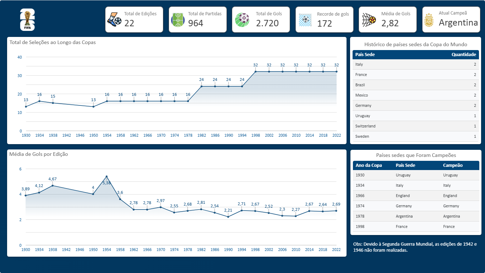
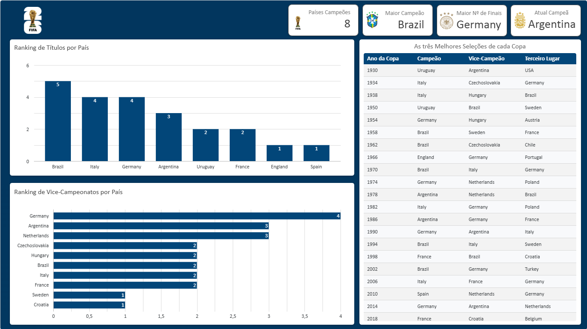
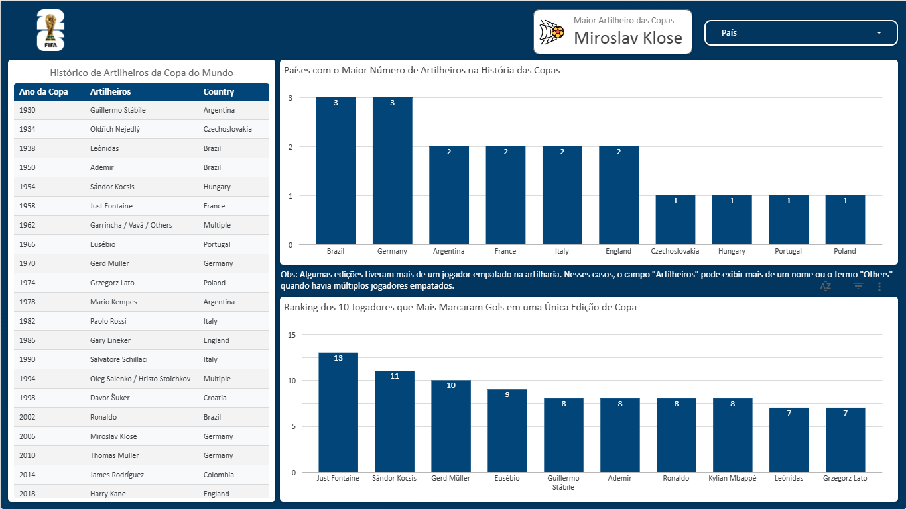

# 🏆 Análise Histórica da Copa do Mundo da FIFA

Pipeline completo de dados: download automatizado via API do Kaggle com Python, análise exploratória com Pandas e dashboard interativa no Looker Studio cobrindo todas as 22 edições da Copa do Mundo entre 1930 e 2022.

---

## 📌 Sobre o Projeto

Este projeto tem como objetivo analisar o histórico completo da Copa do Mundo da FIFA, desde a primeira edição em 1930 no Uruguai até a edição de 2022 no Qatar. O pipeline vai desde o download automatizado do dataset até a criação de uma dashboard interativa e de acesso público no Looker Studio.

**Dataset utilizado:** [FIFA and Football Complete Dataset 1930-2022](https://www.kaggle.com/datasets/zkskhurram/fifa-and-football-complete-dataset-19302022) — Kaggle  
**Autor do Dataset:** Khurram Shahzad  
**Licença:** CC BY 4.0

---

## 🔧 Tecnologias Utilizadas

| Tecnologia | Finalidade |
|------------|------------|
| Python | Linguagem principal |
| kagglehub | Download automatizado do dataset via API |
| python-dotenv | Gerenciamento seguro do token de autenticação |
| Pandas | Análise exploratória e tratamento dos dados |
| Matplotlib | Visualizações exploratórias durante a análise |
| Looker Studio | Dashboard interativa e compartilhável |

---

## 🚀 Como o Pipeline Funciona

### 1. Download Automatizado (kagglehub)
O token de autenticação do Kaggle é armazenado em um arquivo `.env` para não expor credenciais no código. O dataset é baixado via API e movido para a pasta `base_kaggle/`.

```python
from dotenv import load_dotenv
import os
import kagglehub
import shutil

load_dotenv(dotenv_path='token.env')
os.environ['KAGGLE_TOKEN'] = os.getenv('KAGGLE_TOKEN')

path = kagglehub.dataset_download('zkskhurram/fifa-and-football-complete-dataset-19302022')
shutil.copytree(path, './base_kaggle', dirs_exist_ok=True)
```

### 2. Análise Exploratória (Pandas)
Foram analisadas as 4 bases disponíveis no dataset, verificando shape, colunas, tipos e valores de cada uma.

```python
import pandas as pd

world_cup   = pd.read_csv('base_kaggle/fifa_world_cup_history.csv')
top_scorers = pd.read_csv('base_kaggle/fifa_world_cup_top_scorers.csv')
rankings    = pd.read_csv('base_kaggle/fifa_world_rankings_jan_2026.csv')
competitions= pd.read_csv('base_kaggle/football_major_competitions.csv')
```

### 3. Tratamento dos Dados
Principais tratamentos realizados:

- Unificação de `West Germany` → `Germany` nas bases `world_cup` e `top_scorers`
- Unificação de `Russia / Bulgaria` → `Multiple` na base `top_scorers`
- Simplificação dos valores da coluna `Best_WC_Finish` na base `rankings`
- Exportação dos CSVs tratados para a pasta `base_tratada/`

```python
# Unificando nomenclaturas
world_cup = world_cup.replace('West Germany', 'Germany')
top_scorers['Country'] = top_scorers['Country'].replace('West Germany', 'Germany')

# Simplificando resultados do ranking
def simplify_finish(val):
    if 'QF' in val:
        return 'Quarterfinals'
    elif 'R16' in val:
        return 'Round of 16'
    else:
        return val

rankings['Best_WC_Finish'] = rankings['Best_WC_Finish'].apply(simplify_finish)
```

### 4. Dashboard no Looker Studio
Os 3 CSVs tratados foram importados no Looker Studio para criação de uma dashboard pública com 3 páginas de análise.

> 🔗 **[Acesse a Dashboard Completa](https://lookerstudio.google.com/reporting/359845e3-a5c9-4d36-8f9b-831b7e236301)**

---

## 📊 Dashboard — Looker Studio

### Página 1 — Geral
Visão macro da história da Copa do Mundo com KPIs gerais, evolução do número de seleções por edição, média de gols ao longo das copas, países sede e sedes que também foram campeãs.



### Página 2 — Países Campeões
Ranking de títulos por país, vice-campeonatos e pódio histórico completo de cada edição.



### Página 3 — Artilheiros
Maior artilheiro da história (Miroslav Klose — 16 gols), países com mais artilheiros e top 10 gols marcados em uma única edição.



---

## 🗂️ Bases Utilizadas

| Base | Descrição | Utilizada |
|------|-----------|-----------|
| `fifa_world_cup_history.csv` | Histórico completo das 22 edições | ✅ |
| `fifa_world_cup_top_scorers.csv` | Artilheiro de cada edição | ✅ |
| `fifa_world_rankings_jan_2026.csv` | Ranking FIFA de janeiro de 2026 | ✅ |
| `football_major_competitions.csv` | Principais competições do mundo | ❌ |

> O dataset `football_major_competitions` foi descartado por conter informações fora do escopo do tema Copa do Mundo.

---

## 📁 Estrutura do Repositório

```
📦 Projeto Copa do Mundo
├── 📁 base_kaggle/             # CSVs originais baixados do Kaggle
├── 📁 base_tratada/            # CSVs exportados após tratamento com Pandas
│   ├── world_cup.csv
│   ├── top_scorers.csv
│   └── rankings.csv
├── 📁 notebook/
│   └── projeto_copa.ipynb      # Notebook com todo o código Python
├── 📁 prints/                  # Capturas de tela da dashboard
│   ├── dashboard_geral.png
│   ├── dashboard_paises.png
│   └── dashboard_artilheiros.png
└── README.md
```

> **Nota:** A pasta `base_kaggle/` com os dados originais do Kaggle não está incluída no repositório.

---

## ▶️ Como Executar

1. Clone o repositório
2. Instale as dependências:
   ```bash
   pip install kagglehub pandas matplotlib python-dotenv
   ```
3. Crie um token de API no Kaggle: **Settings → API → Create New Token**
4. Crie um arquivo `token.env` na pasta `notebook/` com o conteúdo:
   ```
   KAGGLE_TOKEN=seu_token_aqui
   ```
5. Execute o notebook célula por célula

---

## 👤 Autor

Feito por **Welyson Filipe** · [LinkedIn](https://linkedin.com/in/seu-perfil) · [GitHub](https://github.com/welysonfilipe)
